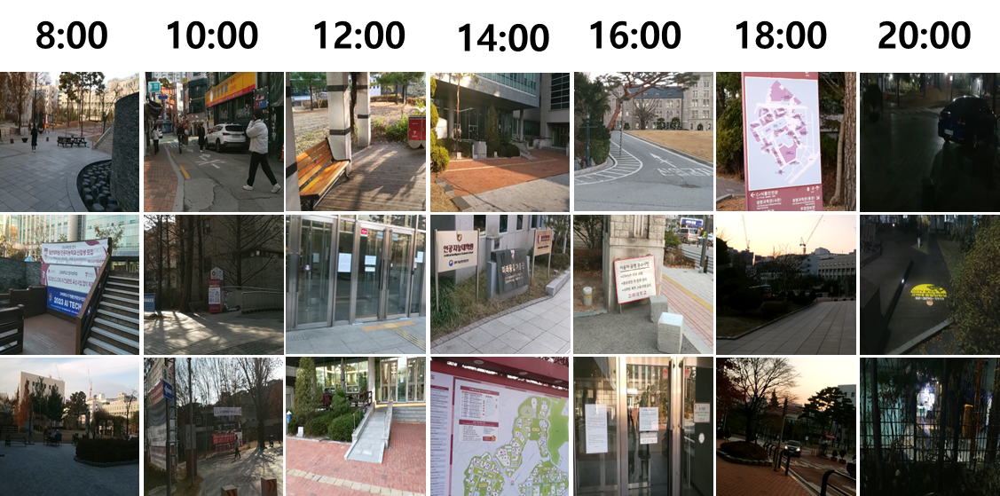
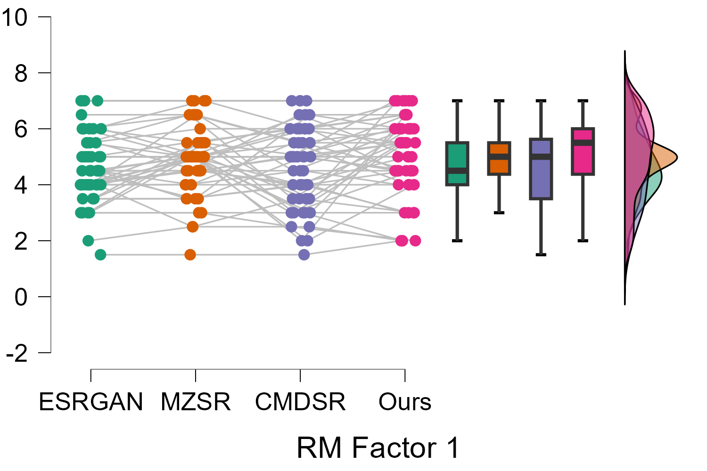

# AAA740-FinalProject
23-2 Korea Univ. SPECIAL TOPICS IN ARTIFICIAL INTELLIGENCE Final Project
Meta-Transfer Learning for Super-resolution in Augmented Reality Domain

* 🌿 Overleaf link for Final Report
  https://www.overleaf.com/read/xztchtmqxhmk#8959bd
  
* 🎓 AR Image Dataset
  https://drive.google.com/drive/folders/17ggPCQdXcYRINPcuWdNTSwSzo4GEigSV?usp=sharing

* 🕸️ Online User Study Google Form
  https://forms.gle/cuEdQUCGid8kpitY7

* 🤓 User Study Result
  https://docs.google.com/spreadsheets/d/1RUWPdVnSepp1GDXtH5mDW0I5ENFYvjWqeOs0RlcAQmY/edit?usp=sharing
  
## Related Work

### Super-Resolution Models

#### [NatSR (2019)] Natural and Realistic Single Image Super-Resolution with Explicit Natural Manifold Discrimination <a href="https://openaccess.thecvf.com/content_CVPR_2019/papers/Soh_Natural_and_Realistic_Single_Image_Super-Resolution_With_Explicit_Natural_Manifold_CVPR_2019_paper.pdf">Link</a>

#### [MZSR (2020)] Meta-Transfer Learning for Zero-Shot Super-Resolution <a href="Meta-Transfer Learning for Zero-Shot Super-Resolution<a href="https://openaccess.thecvf.com/content_CVPR_2020/papers/Soh_Meta-Transfer_Learning_for_Zero-Shot_Super-Resolution_CVPR_2020_paper.pdf">Link</a>

#### [Real-ESRGAN (2021)] Real-ESRGAN: Training Real-World Blind Super-Resolution with Pure Synthetic Data <a href="https://arxiv.org/abs/2107.10833>Link</a>

#### [CMDSR (2022)] Conditional Hyper-Network for Blind Super-Resolution with Multiple Degradations. <a href="https://ieeexplore.ieee.org/abstract/document/9785471">Link</a>

## Input Datas

**Pictures taken Hololens2**

## Experimental Results

**Results on various models**

**Results with User Study**

